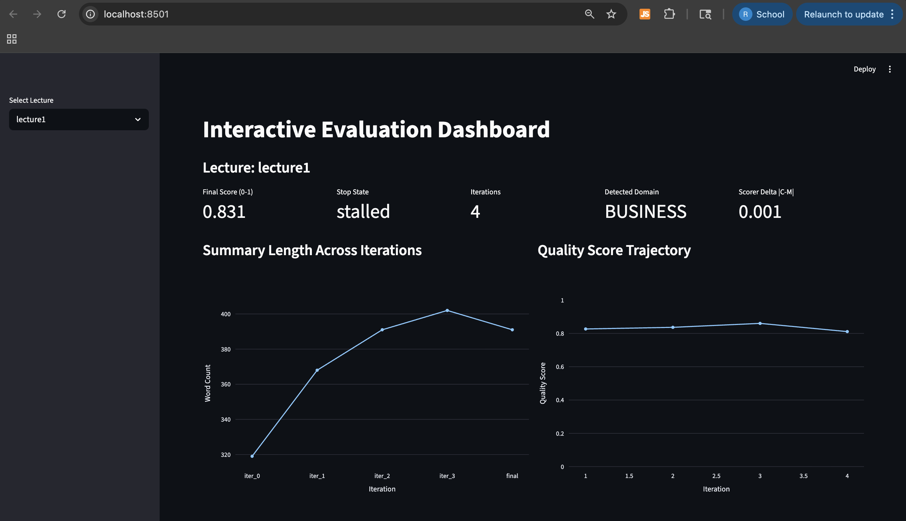

# DSC180 – Evaluation Strategies for Next-Generation AI Systems

**Capstone Project | UC San Diego | Spring 2026**

**Final Poster (PDF):** [DSC180 Final Poster](artifacts/DSC180_FINAL_POSTER.pdf)

**Final Paper (PDF):** [Iterative Refinement for Next-Gen LLMs](artifacts/Q2/Iterative_Refinement_NextGen_LLMs.pdf?raw=1)

This repository implements an end-to-end pipeline for generating, refining, and evaluating large-language-model (LLM) summaries of university lecture slides.

Our capstone goal is to study how next-generation LLM systems can be evaluated and improved in a way that is reproducible, domain-aware, and practically useful for educational content. Instead of relying on a single metric or fixed iteration schedule, this project combines deterministic signals, LLM rubric judging, pairwise preference testing, and hybrid final scoring to better capture summary quality. The pipeline is designed for research and applied benchmarking: it records full intermediate artifacts, exposes stopping behavior, and supports cross-domain comparison across multiple UCSD lecture datasets.

## Table of Contents

- [Headline Outcomes](#headline-outcomes)
- [Quick Start](#quick-start)
- [Project Structure](#project-structure)
- [Running Evaluation](#running-evaluation)
- [Current Pipeline (What Happens Internally)](#current-pipeline-what-happens-internally)
- [Results Summary](#results-summary)
- [Human Evaluation](#human-evaluation)
- [Dashboards](#dashboards)
- [Known Limitations](#known-limitations)
- [Adding Your Own Lecture](#adding-your-own-lecture)
- [Authors](#authors)

## Headline Outcomes

- Across the 7-lecture benchmark, the current pipeline consistently improves quality while preserving stable behavior across seeds.
- For detailed, reproducible metrics (policy ablations, robustness summaries, and human-calibration results), see **Results Summary** and **Human Evaluation** below.

Given a lecture PDF, the system:
1. Generates an initial summary (`S0`)
2. Iteratively refines it with lever-based guidance
3. Evaluates quality using deterministic signals + LLM judges
4. Produces reproducible artifacts (`iter_*.txt`, `final.txt`, `result.json`, pairwise outputs)

While this repository uses lecture PDFs as the benchmark input format, the pipeline architecture is domain-agnostic: the same workflow can be applied to dense technical document sets where reliable distillation is required.

## Industry Relevance (Honda)

- Honda needs to process large volumes of technical documentation, safety manuals, engineering specifications, and research reports; this pipeline generalizes to any domain where dense text needs to be distilled reliably.
- The domain-aware rubric judging is directly applicable to technical domains Honda cares about: if lecture PDFs are replaced with automotive engineering documents, the evaluation framework still applies.
- Hallucination detection and risk-adjusted scoring are especially relevant for safety-critical settings where fabricated content can create downstream risk.

## Quick Start

```bash
# 1) Create environment
conda env create -f environment.yml
conda activate dsc180a-eval

# 2) Set API key
echo "OPENAI_API_KEY=your_key_here" > .env

# 3) Run one lecture
python -m src.experiments.run_eval lecture1

# 4) Run all lectures
python -m src.experiments.run_eval all
```

Typical runtime: ~1–4 minutes for a single lecture run (longer under API latency/rate limits).

No human reference file is required for the default pipeline mode.

Then review generated artifacts in:

```
data/summaries/refined_iterations/lecture1/
example_run/lecture1/
```

## Key Innovations

- **Lever-Based Iterative Refinement**: criterion-driven iteration instead of fixed loops
- **Domain-Aware Rubric Judging**: automatic domain detection with discipline-aware criteria
- **Hybrid Final Scoring**: combines comprehensive layered score with explicit weighted score
- **Trend-Aware Stopping**: decision-table stopping (`pass`, `borderline`, `stalled`) with plateau detection
- **Research-Grade Outputs**: full metadata and intermediate traces for reproducibility


## Dependencies

This project uses packages listed in `environment.yml` and `requirements.txt`, including:

- Python 3.10.20
- openai 2.26.0
- python-dotenv 1.2.2
- pymupdf 1.27.1
- nltk 3.9.3
- streamlit 1.55.0
- plotly 6.6.0
- numpy 2.2.6
- scipy 1.15.2
- scikit-learn 1.7.2
- matplotlib 3.10.8

> **NLTK resources:** On first run, the pipeline auto-downloads `punkt`, `punkt_tab`, `omw-1.4`, and `wordnet`. Ensure internet access for the initial execution.

## Project Structure

```
HondaResearchLabs_DSC180A-Eval-Systems-Of-NextGen-LLMs/
├── assets/
│   ├── 99p-logo.png
│   └── hdsi-white.png
├── data/
│   ├── references/                    # Optional legacy benchmark references
│   ├── slides/                        # Lecture PDFs
│   └── summaries/
│       ├── bare_bones_experiment/     # Judge-only experiment outputs
│       ├── model_s0/                  # Initial LLM summaries
│       ├── pairwise_experiment/       # Pairwise ablation outputs
│       └── refined_iterations/
│           └── lectureX/
│               ├── iter_0.txt ... iter_n.txt
│               ├── final.txt
│               ├── result.json
│               └── pairwise_s0_vs_refined.json
├── example_run/
│   ├── lecture1/
│   ├── lecture2/
│   ├── ...
│   └── lecture7/                      # Sample run artifacts for demo use
├── outputs/
│   ├── hallucination_tuning/          # Penalty tuning experiment artifacts
│   ├── pairwise_overall_winners.log   # Canonical pairwise winner log
│   ├── policy_ablation/               # Tuned vs legacy aggregate summaries
│   └── seed_robustness/               # Multi-seed aggregate summaries
├── dev_notes/                         # Development notes and archived test scripts
├── src/
│   ├── evaluation/
│   │   ├── NormalSchema.py
│   │   ├── pairwise.py
│   │   ├── pipeline.py
│   │   └── scoring.py
│   ├── experiments/
│   │   ├── bare_bones_judge_experiment.py
│   │   ├── build_human_calibration_dataset.py
│   │   ├── compare_models.py
│   │   ├── multi_seed_robustness.py
│   │   ├── pairwise_experiment.py
│   │   ├── policy_ablation_experiment.py
│   │   ├── prepare_faithfulness_labeling_set.py
│   │   ├── refine_demo.py
│   │   ├── run_eval.py
│   │   ├── sanity_checks.py
│   │   └── tune_hallucination_penalty.py
│   ├── models/
│   │   ├── judge.py
│   │   ├── lever_based_refinement.py
│   │   ├── llm_client.py
│   │   ├── refinement.py
│   │   └── summarizer.py
│   ├── utils/
│   └── visualization/
├── artifacts/
│   ├── DSC180_FINAL_POSTER.pdf
│   ├── Q1/
│   └── Q2/
├── .env.example
├── environment.yml
├── requirements.txt
├── startup.sh
├── startup.ps1
└── README.md
```

## Environment Setup

### Option A: Start-Up Script (recommended)

**Mac/Linux (bash)**
```bash
chmod +x startup.sh
source startup.sh
```

**Windows (PowerShell)**
```powershell
. .\startup.ps1
```

### Option B: Manual Setup

```bash
conda env create -f environment.yml
conda activate dsc180a-eval
```

Create `.env` in project root:

```bash
OPENAI_API_KEY=your_key_here
```

Deactivate environment:

```bash
conda deactivate
```

## Running Evaluation

### Standard run

```bash
python -m src.experiments.run_eval lecture1

# Run every lecture discovered from data/slides/lecture*.pdf
python -m src.experiments.run_eval all
```

`run_eval` supports both single-lecture (`lectureN`) and all-lecture (`all`) execution, and defaults to `hallucination_policy=tuned`.

Optional explicit policy examples:

```bash
# Explicit tuned (same behavior as default)
python -m src.experiments.run_eval lecture1 no yes 4.0 0.03 12 4 0.7 tuned

# Legacy scoring behavior
python -m src.experiments.run_eval lecture1 no yes 4.0 0.03 12 4 0.7 legacy

# Human-calibrated policy preset
python -m src.experiments.run_eval lecture1 no yes 4.0 0.03 12 4 0.7 human_tuned

# Calibrated override (human-tuned values) without editing code
python -m src.experiments.run_eval lecture1 no yes 4.0 0.03 12 4 0.7 tuned 0.20 0.125
```

### Full CLI signature

```bash
python -m src.experiments.run_eval \
    lecture1|all [force_regen] [use_lever_based] [min_avg_score] \
    [min_change_threshold] [max_iterations] [min_iterations] [min_agreement] \
    [hallucination_policy] [hallucination_alpha] [hallucination_beta]
```

Parameters:
- `lecture1|all`: single lecture id (`lectureN`) or `all` to run all discovered lectures (scope of run)
- `force_regen`: optional (`yes`/`no`), default `no` (regenerate `S0` even if it exists)
- `use_lever_based`: optional (`yes`/`no`), default `yes` (enable lever-guided refinement/stopping)
- `min_avg_score`: optional float, default `4.0` (target rubric average for passing quality)
- `min_change_threshold`: optional float, default `0.03` (minimum iteration improvement to count as progress)
- `max_iterations`: optional int, default `12` (hard cap on refinement loop)
- `min_iterations`: optional int, default `4` (minimum loop count before early-stop checks)
- `min_agreement`: optional float, default `0.7` (**legacy/compat parameter**; retained for older workflows)
- `hallucination_policy`: optional (`tuned`/`legacy`/`human_tuned`), default `tuned` (risk penalty profile)
- `hallucination_alpha`: optional float, default from selected policy (overrides damping alpha if provided)
- `hallucination_beta`: optional float, default from selected policy (overrides subtractive beta if provided)

Note: CLI arguments are positional. If you set `hallucination_alpha`/`hallucination_beta`, pass preceding arguments as shown in the examples above.

`run_eval` works without `data/references/lectureN_reference.txt` in default reference-free mode.

Outputs are written to:

```
data/summaries/refined_iterations/lectureN/
    iter_0.txt
    iter_1.txt
    ...
    final.txt
    result.json
    pairwise_s0_vs_refined.json
```

`iter_X` count varies depending on stopping behavior.

## Current Pipeline (What Happens Internally)

### 1) Generation + Refinement
- Generate/reuse `S0`
- Iteratively refine using rubric feedback + pairwise winner selection

### 2) Trend-Aware Stopping (domain-agnostic)
The lever-based controller uses a decision table with minimum-iteration enforcement:
- **pass**: strict quality/signal criteria met, or high quality plateau
- **borderline**: moderate quality + stable trajectory
- **stalled**: trend is not improving meaningfully
- **max_iters**: safety stop

This avoids both premature stopping and endless loops.

At finalization, the pipeline applies a **best-of-last-k** safeguard (`k=3`)
and keeps the highest-quality state among the last evaluated iterations,
which helps reduce end-of-run noise from a single weak final rewrite.
This selection is recorded in `refinement_metadata.stopping_reason`
as `final_selection: best_of_last_3 (...)` when triggered.

### 3) Evaluation Layers
- **Domain-aware rubric** (coverage, faithfulness, organization, clarity, style)
- **Deterministic signals** (`length_error`, `section_coverage_pct`, `glossary_recall`, `suspected_hallucination_rate`)
- **Pairwise preference** during refinement candidate selection

### 4) Final Scoring

Comprehensive layered score:

$$
C = domain_{rubric}
$$

Manual weighted score (explicit baseline):

$$
M = (0.8 \cdot base + 0.2 \cdot coverage) - \beta \cdot 2^{h}
$$

Raw quality (pre-risk):

$$
Q_{raw} = 0.7C + 0.3M
$$

Domain-aware damping coefficient:

$$
\alpha_{eff} = \alpha \cdot m_{domain}
$$

Raw damping and capped damping:

$$
d_{raw} = 1 - \alpha_{eff} \cdot h
$$

$$
d = \mathrm{clip}(d_{raw}, d_{min}, d_{max}), \quad d_{min}=0.75,\ d_{max}=1.0
$$

Risk-adjusted final score:

$$
Q_{risk} = Q_{raw} \cdot d
$$

Stored final score:

$$
final\_score\_{0to1} = Q_{risk}
$$

Where:
- `tuned` policy default: $\alpha=0.05$, $\beta=0.0$
- `legacy` policy: $\alpha=0.15$, $\beta=0.10$
- `human_tuned` policy: $\alpha=0.20$, $\beta=0.125$
- stricter domain multipliers are applied for technical domains (e.g., engineering/math)

Note: these are the runtime defaults used by `run_eval` unless overridden by CLI arguments.

`result.json` logs both leaderboard scores (`raw_quality_score`, `risk_adjusted_score`) plus full policy metadata.

## Human Evaluation

We use a human-labeled faithfulness calibration workflow to validate and tune the hallucination-risk policy.

### Workflow
- Generate candidate summaries for annotation: `python -m src.experiments.prepare_faithfulness_labeling_set`
- Fill `human_faithfulness_1to5` in `outputs/hallucination_tuning/human_labeling_candidates.jsonl`
- Build scored calibration dataset: `python -m src.experiments.build_human_calibration_dataset`
- Tune policy on labeled data: `python -m src.experiments.tune_hallucination_penalty outputs/hallucination_tuning/human_calibration_dataset.json`

### Current Checked-in Calibration (from `outputs/hallucination_tuning/report.json`)
- Labeled samples: **50**
- Lectures covered: **7** (`lecture1`–`lecture7`)
- Correlation under calibration baseline policy (`alpha=0.15`, `beta=0.10`):
    - Spearman(final vs comprehensive): **0.698**
    - Spearman(final vs human faithfulness): **0.808**
    - Spearman(final vs hallucination): **-0.692** (more negative is better)
- Best policy on this labeled set: **`alpha=0.20`, `beta=0.125`**
- Runtime note: the current `run_eval` default remains `tuned` (`alpha=0.05`, `beta=0.0`); use CLI overrides if you want to run with the calibration-recommended values.

### Artifacts
- Raw annotation rows: `outputs/hallucination_tuning/human_labeling_candidates.jsonl`
- Built calibration dataset: `outputs/hallucination_tuning/human_calibration_dataset.json`
- Tuning report: `outputs/hallucination_tuning/report.json`

## Example Sample Run

A complete sample run is provided in:

```
example_run/lecture1/
    iter_0.txt
    iter_1.txt
    iter_2.txt
    iter_3.txt
    final.txt
    result.json
    pairwise_s0_vs_refined.json
    s0_summary.txt
```

This directory is intended for quick demonstration.

## Result Schema (`result.json`)

Key fields:

```
refined_summary
signals
rubric
agreement
comprehensive_scoring
hybrid_scoring
leaderboard_scores
iteration_score_table
refinement_metadata
final_score_0to1
lecture_title
```

`agreement` is retained for compatibility and is marked unused in reference-free mode.

Notable metadata fields include stopping reason, iteration history, lever history, and quality trajectory.

`iteration_score_table` provides a compact per-iteration trace for plotting/reporting
(rubric average, quality score, word count, change magnitude, and key signals).

## Results Summary

The following summary is based on checked-in aggregate artifacts under `outputs/`.

| Category | Finding |
|---|---|
| Tuned vs Legacy | `tuned` is better on **7/7** lectures; average delta **+0.076** final score. |
| Robustness | Across seeds `11,22,33`, grand mean final score is **0.845** with std **0.017**. |
| Hardest lecture (seed-mean) | `lecture3` has the lowest mean final score (**0.825**), aligning with theory-heavy humanities difficulty. |
| Strongest lectures (seed-mean) | `lecture2` (**0.871**) and `lecture7` (**0.869**) are the highest. |
| Largest policy gains | Biggest `tuned - legacy` improvements are `lecture7` (**+0.160**) and `lecture6` (**+0.113**). |

Primary sources:
- `outputs/policy_ablation/tuned_vs_legacy_summary.json`
- `outputs/seed_robustness/multi_seed_summary.json`
- `outputs/hallucination_tuning/report.json`

For calibration-specific details, see the **Human Evaluation** section above.

## Additional Experiments

These experiments are LLM-call heavy and can take a while to complete.

Typical wall-clock estimates on this project setup:
- Single lecture experiment run: ~1–4 minutes
- `policy_ablation_experiment all` (7 lectures): ~20–45 minutes
- `multi_seed_robustness all` with seeds `11,22,33` (21 total runs): ~25–60 minutes
- Under API latency spikes/rate limits, full runs can take up to ~90 minutes

Tip: for faster iteration, start with one lecture (e.g., `lecture6`) before launching `all`.

### Multi-seed robustness (mean/std)

```bash
# all lectures, default seeds 11,22,33
python -m src.experiments.multi_seed_robustness all

# one lecture, custom seeds
python -m src.experiments.multi_seed_robustness lecture6 11,22,33
```

Outputs:
- `outputs/seed_robustness/multi_seed_summary.json`
- `outputs/seed_robustness/multi_seed_summary.txt`

### Tuned vs legacy policy ablation

```bash
# all lectures
python -m src.experiments.policy_ablation_experiment all

# single lecture
python -m src.experiments.policy_ablation_experiment lecture6
```

Outputs:
- `outputs/policy_ablation/tuned_vs_legacy_summary.json`
- `outputs/policy_ablation/tuned_vs_legacy_summary.txt`

## Dashboards

Run after generating evaluation outputs.

### Static dashboard

```bash
python -m src.visualization.dashboard lecture1
```

By default, this now renders:
- a single-lecture dashboard (current pipeline metrics), and
- a cohort insights view sourced from `example_run/`.

Optional flags:

```bash
# Disable cohort insights panel
python -m src.visualization.dashboard lecture1 --no-cohort
```

### Interactive Streamlit dashboard

```bash
streamlit run src/visualization/interactive_dashboard.py
```

Includes summary trends, rubric visuals, score-component diagnostics, stop-state diagnostics, cohort insights (`example_run`), and full-text iteration views.

Dashboard preview:



## Provided Dataset Coverage

The repository includes multiple lecture/reference pairs across domains (business, humanities, social sciences, computer science, and psychology) under:

- `data/slides/lectureN.pdf`
- `data/references/lectureN_reference.txt`
- `data/summaries/model_s0/lectureN.txt`
- `data/summaries/refined_iterations/lectureN/`

### Example Test Data

We have provided basic test results within the following domains:

- `data/summaries/refined_iterations/lecture1/` - UCSD MGT 45 (Financial & Managerial Accounting) [Dr. Andreya Pérez Silva, aperezsilva@ucsd.edu] - Week 1 Slides
- `data/summaries/refined_iterations/lecture2/` - UCSD MGT 45 (Financial & Managerial Accounting) [Dr. Andreya Pérez Silva, aperezsilva@ucsd.edu] - Week 2 Slides
- `data/summaries/refined_iterations/lecture3/` - UCSD LATI 10 (Reading North by South: Latin American Studies and the US Liberation Movements) [Dr. Amy Kennemore, akennemo@ucsd.edu] - Week 3 Slides
- `data/summaries/refined_iterations/lecture4/` - UCSD ANTH 2 (Human Origins) [Maria Carolina Marchetto, PhD, mcmarchetto@ucsd.edu] - Week 2 Slides
- `data/summaries/refined_iterations/lecture5/` - UCSD EDS/SOCI 117 (Language, Culture, and Education) [Gabrielle Jones, Ph.D., gajones@ucsd.edu] - Week 2 Wednesday Slides
- `data/summaries/refined_iterations/lecture6/` - UCSD DSC 100 (Introduction to Data Management) [Babak Salimi, bsalimi@ucsd.edu] - Week 3 Slides
- `data/summaries/refined_iterations/lecture7/` - UCSD COGS 14A (Intro to Research Methods) [Sarah C. Creel, screel@ucsd.edu] - Week 5 Slides

The LLM-generated initial summaries for each test set are stored here:

```
data/summaries/model_s0/lecture1.txt
data/summaries/model_s0/lecture2.txt
data/summaries/model_s0/lecture3.txt
data/summaries/model_s0/lecture4.txt
data/summaries/model_s0/lecture5.txt
data/summaries/model_s0/lecture6.txt
data/summaries/model_s0/lecture7.txt
```

And the human-written reference summaries for each test set are stored here:

```
data/references/lecture1_reference.txt
data/references/lecture2_reference.txt
data/references/lecture3_reference.txt
data/references/lecture4_reference.txt
data/references/lecture5_reference.txt
data/references/lecture6_reference.txt
data/references/lecture7_reference.txt
```

Note on pipeline evolution: the initial/legacy workflow emphasized human-reference-driven evaluation. The current default pipeline is reference-free and uses multi-signal + model-judge evaluation (deterministic signals, rubric judging, pairwise preference, and hybrid scoring). Human reference files are retained only for continuity and optional legacy diagnostics.

## Known Limitations

The hallucination signal can be conservative for some lecture styles (for example SQL-heavy technical slides or humanities narratives), which may slightly over-penalize otherwise acceptable summaries. In practice, risk-adjusted scoring, trend-aware stopping, and multi-seed robustness checks help reduce instability from this effect.

## Adding Your Own Lecture

To evaluate a new lecture end-to-end with the current CLI pipeline:

1. Add your slide deck as `data/slides/lectureN.pdf` (for the next available `N`).
2. (Optional, legacy) Add a reference summary as `data/references/lectureN_reference.txt` if you want benchmark continuity.
3. Run the evaluation:

```bash
python -m src.experiments.run_eval lectureN

# or run all available lectures
python -m src.experiments.run_eval all
```

4. Review outputs in:

```
data/summaries/refined_iterations/lectureN/
```

5. (Optional) Copy artifacts into:

```
example_run/lectureN/
```

The `example_run` artifacts are provided as presentation/demo examples.

## Future Directions

- Improve scorer calibration and disagreement-based confidence reporting
- Expand multimodal handling for charts, figures, and equations
- Add longitudinal/cohort analytics across larger lecture corpora
- Support human-in-the-loop editing and reviewer-facing diagnostics

## Authors

- Rahul Sengupta ([LinkedIn](https://www.linkedin.com/in/rahul-sg/))
- Akshay Medidi ([LinkedIn](https://www.linkedin.com/in/akshay-medidi-934a81202/))
- Zeyu (Edward) Qi ([LinkedIn](https://www.linkedin.com/in/qi-zeyu/))
- Zachary Thomason ([LinkedIn](https://www.linkedin.com/in/zachary-thomason/))

## Mentors

- Rajeev Chhajer
- Ryan Lingo

## License

This project was developed for the UC San Diego DSC180 Capstone (2025–2026 academic year).

**Evaluation Strategies for Next-Generation AI Systems**  
*Industry Partners - Honda Research Labs and 99P Labs*

<table>
    <tr>
        <td align="left" valign="middle" width="180">
            
        </td>
        <td align="center" valign="middle" width="320">
            
        </td>
    </tr>
</table>